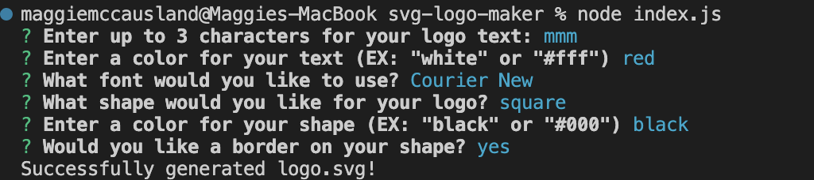

# SVG Logo Maker

## Table of Contents

- [Description](#description)
- [License](#license)
- [Installation](#installation)
- [Testing](#testing)
- [Usage](#usage)
- [Contributors](#contributors)
- [Walkthrough Video & Screenshot](#walkthrough-video--screenshot)
- [Questions](#questions)

## Description

Users will be able to generate a simple logo for their projects so that they won't have to pay a graphic designer.

## Installation

List specific steps to help remove ambiguity and get people to use your project as quickly as possible. Let people know if it only runs in a specific context like a particular programming language version or operating system or has dependencies that have to be installed manually.  
To install necessary dependencies, run the following command in the terminal:

1.  Clone the repo

```
git clone git@github.com:your-username/svg-logo-maker.git
```

2. Install and initialize NPM packages

```
npm install inquirer@8.2.4
npm init -y
```

3. Install Jest

```
npm install --save-dev jest
```

## Testing

Mention and explain all the tests that can be performed with the code examples you’ve provided.  
To run tests, run the following command in the terminal:

```
npm run test
```

## Usage

Use this space to show useful examples of how a project can be used. Additional screenshots, code examples and demos work well in this space. You may also link to more resources.

1. To begin using this project, run the following command in the terminal:

```
node index.js
```

2. You will be prompted with questions about design choices for you svg. Answer each of the questions in the terminal to have a svg logo generated. EX:

```
What shape would you like to use?
    - square
    - circle
    - triangle
```

3.  Once all questions are answered, you will be able to find your newly created svg logo under the folder name of "examples".

## Contributors

Show your appreciation to those who have contributed to the project.
Also state if you are open to contributions and what your requirements are for accepting them. For people who want to make changes to your project, it's helpful to have some documentation on how to get started.
1. Fork the Project
2. Create your Feature Branch  
```
git checkout -b feature/featureName
```
3. Commit your Changes  
```
git commit -m 'Add something featureName'
```
4. Push to the Branch  
```
git push origin feature/featureName
```
5. Open a Pull Request

## WalkThrough Video & Screenshot
Click the image below to watch a walkthrough:  
[]()

## Questions

To view more of my work, visit my GitHub page: [GitHub: maggiemcc](https://github.com/maggiemcc)
If you have any questions, please feel free to contact me by email: maggiemccausland@hotmail.com
